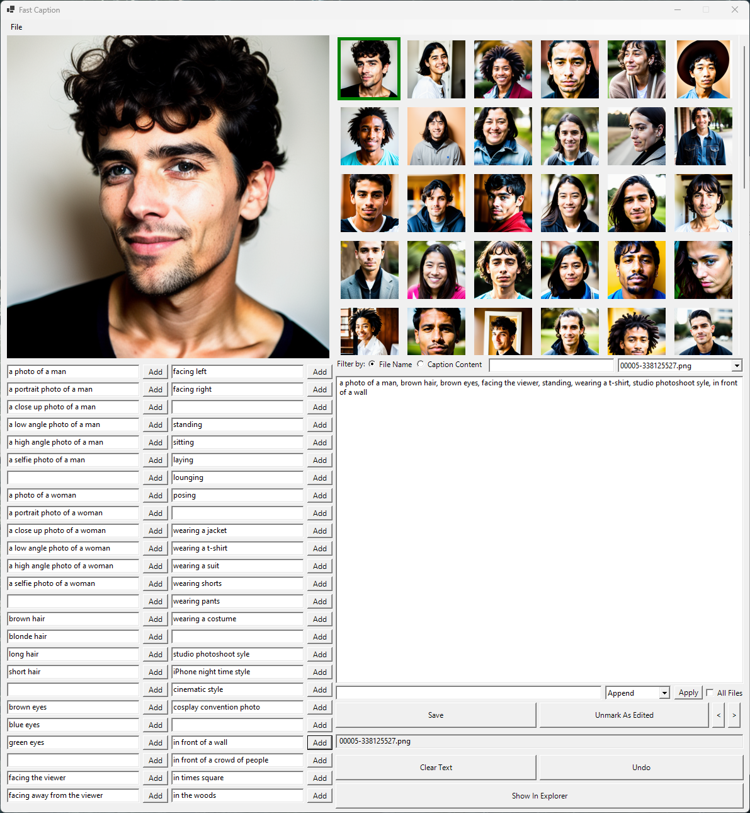

# Fast Caption
An image captioning GUI written in PowerShell

This is useful for captioning images for text-to-image projects like Stable Diffusion.

PowerShell v7 required

This script will generate a GUI that will allow the fast editing of captions via a preset system.
It will display thumbnails of each image, so they can be browsed and edited very easily.
The captions are stored alongside the image in a text file that shares the same name as the image.

Usage:
1. Run the batch file, or the script from a terminal
2. Select a folder with images in it
3. Choose an image to edit from the flow layout panel
4. Edit it's caption in the text box
5. Add the text presets to your existing caption
6. Save and mark the caption as edited
7. Repeat as needed

Configuration:
All of your presets are stored in a cfg file inside directory you have chosen to edit images
The preset template is stored in the cap.cfg file, you can change this to suit you own needs

The window will scale to 90% of your primary monitor's resolution, to allow for as many presets as possible, if you change monitor resolution, your presets may get truncated, so keep a backup!

